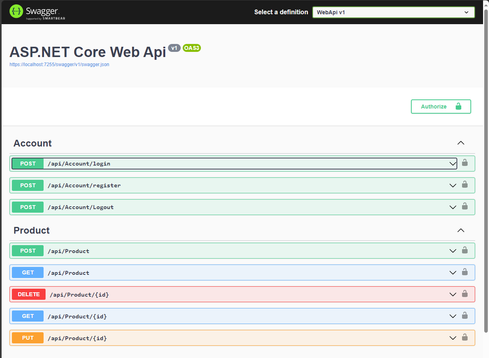

# ASP.Net Core Web API

Fully functional CRUD operations ASP.Net Core Web Api with Repository Pattern and Dependency Injection (.Net 6).


## Project Highlights:

- CRUD operation in ASP.Net Core Web API.
- Token-based authentication and authorization using ASP.Net Core Identity framework.
- Model binding and model validation.
- Domain Driven Design with Repository Pattern and Dependency Injection.
- Dynamic LINQ Queries with Expression Trees.
- Docker container enabled.


## How to run
```
$> git clone https://github.com/kahmingt/ASP.NET-Core-Web-API.git
$> cd <root>
$> dotnet clean ASP.NET-Core-Web-API.sln --verbosity q
$> dotnet build ASP.NET-Core-Web-API.sln --verbosity q
$> docker-compose up --build --force-recreate
$> https://localhost:51199/swagger/index.html
```


## Technology Stack
1. ASP.NET core Web API (.Net 6.0)
2. Microsoft® SQL Server® 2022 Express (16.0.1050)
3. Docker 24.0.6
4. Open API (Swagger)
5. Postman## Images


## Image
